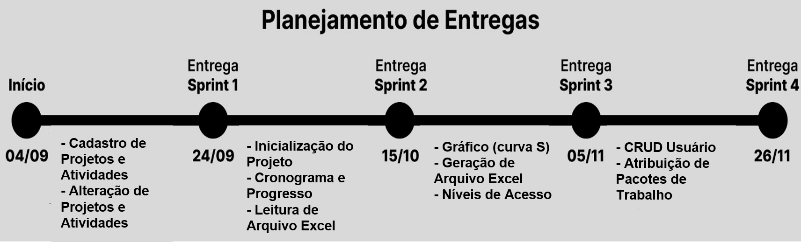

<h1 align="center">Software de Gestão de Times de Projetos Complexos</h1>
<h2 align="center">FATEC Prof Jessen Vidal, São José dos Campos - 3º Semestre DSM 2023</h2>

    <a href="#sobre">Sobre</a> | 
    <a href="#tecnologias">Tecnologias</a> |
    <a href="#equipe">Equipe</a> | 
    <a href="#entregas">Entregas</a> | 
    <a href="#backlogs">Backlogs</a> |
    <a href="#links">Links</a> |
    <a href="#versao">Versionamento</a> |
    <a href="#gif">Gif</a> |

<h1 align="center">Sobre:</h1>

Esta é uma iniciativa de desenvolvimento de um software que visa facilitar a gestão de equipes multidisciplinares envolvidas em projetos complexos, planejado para uma empresa parceira do ramo armamentista, que tradicionalmente utiliza metodologias estabelecidas na Gestão de Projetos e Engenharia de Sistemas, incluindo o uso do conceito do IPDT (Integrated Product Development Team) e do WBS (Work Breakdown Structure), que organizam equipes multidisciplinares para desenvolver projetos. 

Inicialmente, um projeto é dividido em partes menores, até o nível de subsistemas. Cada subsistema é designado a um responsável técnico chamado RIPDT (Responsável por IPDT), que atua como gestor de projeto. Os RIPDTs recebem pacotes de trabalho e prazos para cumprir. Eles são responsáveis por negociar equipes de trabalho, planejar atividades, acompanhar o progresso do trabalho e relatar o status do desenvolvimento em reuniões mensais de acompanhamento.

No entanto, o processo atual de preenchimento de documentos necessários para cada etapa do processo é manual, com documentos dispersos em diferentes arquivos, como planilhas Excel. O desafio proposto é desenvolver um "Software para Gestão de Times de Projetos Complexos" que automatize todo o trabalho de gerenciamento de equipes integradas. Esse software estaria acessível por meio de um portal na intranet da empresa, facilitando o acompanhamento e a gestão de projetos complexos que estão em desenvolvimento.

<h1 align="center">Tecnologias/Pré-Requisitos:</h1>

  </img>&nbsp;
  </img>&nbsp;
  </img>&nbsp;
  </img>&nbsp;
  </img>&nbsp;
  </img>&nbsp;
  </img>&nbsp;

<h1 align="center">Equipe:</h1>

  | Função | Foto | Nome | GitHub | LinkedIn |
  | :-: | :-: | :-: | :-: | :-: |
  | Backend Dev |  | Aline C. Correa Costa | [GitHub](https://github.com/acorreac) | [LinkedIn](https://www.linkedin.com/in/alinecorrea/) |
  | Scrum Master |  | Augusto Henrique Buin | [GitHub](https://github.com/AugustoBuin) | [LinkedIn](https://www.linkedin.com/in/augusto-henrique-buin-a58bb0208/) |
  | Backend Dev |  | Bruno Denardo  | [GitHub](https://github.com/brunodenardo) | [LinkedIn](https://www.linkedin.com/in/bruno-denardo/) |
  | Frontend Dev |  | José V. H. Lopes de Souza | [GitHub](https://github.com/HenningerJv) | [LinkedIn](https://www.linkedin.com/in/jose-victor-henninger-7661b928a/) |
  | Backend Dev |  | Matheus Fernando Vieira de Melo | [GitHub](https://github.com/Matheusfvm) | [LinkedIn](www.linkedin.com/in/matheus-melo-b09474224) |
  | Frontend Dev |  | Murilo Henrique Sangi da Silva Lima | [GitHub](https://github.com/MuriloLima03) | [LinkedIn](https://www.linkedin.com/in/murilo-sangi-062780285/) |
  | Product Owner |  | Pedro Henrique Silva Almeida | [GitHub](https://github.com/PedroHSdeAlmeida) | [LinkedIn](https://www.linkedin.com/in/pedroalmeidadev/) |
  | Frontend Dev |  | Renan Souza Neves | [Github](https://github.com/Renan-Neves) | [LinkedIn](https://br.linkedin.com/in/renan-neves-286735224) |
  | Fullstack Dev |  | Vinicius de Oliveira Laranjeiro | [GitHub](https://github.com/noo-e) | [LinkedIn](https://www.linkedin.com/in/vinicius-laranjeiro-296b371bb) |

<h1 align="center">Entregas:</h1>
O projeto tem por base a metodologia ágil SCRUM, por isso foi separado em 4 entregas com sprints de 21 dias de duração cada uma.
  

 

<h1 align="center">Links:</h1>
<ul>
    <li><a href="https://www.figma.com/file/RdjecRsWs3sNPRnyn5F1F1/API-3?type=design&node-id=0%3A1&mode=design&t=0AXhwDPecYUS77vV-1">Figma com protótipo do projeto</a></li>
</ul>

<h1 align="center">Versionamento:</h1>

Versão Atual: 1.0
* Pré-Alpha (Versão não testada)
* <a href="#">1.0 - Sprint 1 </a>
* <a href="#">2.0 - Sprint 2 </a>
* <a href="#">3.0 - Sprint 3 </a>
* <a href="#">4.0 - Sprint 4 </a>

<h1 align="center">Gif:</h1>

</img>&nbsp;

<h1 align="center">Backlog do Produto</h1>

| Sprint | Requisitos | User Story | 
| :-: | :-: | :-: |
| **01** | Cadastro de Projeto | Eu como gerente desejo criar novos projetos diretamente no sistema, a fim de não depender de arquivos excel para o mesmo |
| **01** | Listagem de Projetos | Eu como gerente desejo vizualizar os projetos já cadastrados para ter acesso a suas informações |
| **01** | Visualização geral do projeto | Eu como gerente/líder desejo poder visualizar os dados de todos subníveis do projeto, a fim de ter um acesso mais detalhado de como está o projeto |
| **01** | Alteração dos dados do projeto | Eu como engenheiro/líder desejo poder editar os dados do projeto antes de sua inicialização, a fim de corrigir possíveis erros e fazer melhorias antes de sua inicialização |
| **01** | Inserção de atividades | Eu como engenheiro/líder desejo poder inserir atividades nos pacotes/subpacotes de trabalho, a fim de contribur com as métricas do projeto |
| **01** | Listagem de atividades |Eu como engenheiro/líder desejo vizualizar as micro atividades de cada pacote/subpacote de trabalho, a fim de poder acompanhar o desenvovimento do projeto |
| **01** | Alteração dos dados da atividade | Eu como engenheiro/líder desejo poder editar as micro atividades do projeto antes de sua inicialização, a fim de corrigir possíveis erros e fazer melhorias antes de sua inicialização |
| **02** | Inicialização do projeto | Eu como engenheiro chefe desejo poder inicializar o projeto, a fim de começar seu desenvolvimento  |
| **02** | cálculo Valor/hora estimados | Eu como engenheiro/líder desejo poder visualizar os valores e as horas de todos subníveis do projeto, a fim de planejar melhor a linha base do conograma |
| **02** | Leitura de arquivo Excel com partes do projeto em diferentes subniveis | Eu como gerente/engenheiro desejo poder fazer o upload de arquivos excel contendo a estrutura do projeto (com subníveis), a fim de automatizar esse processo, e após essa leitura e estruturação, deve ser possível a edição do mesmo |
| **02** | Definir linha base do cronograma (Planejar o avanço do projeto) | Eu como engenheiro chefe desejo poder fazer o planejamento do avanço do projeto, a fim de organizar melhor o desenvolvimento |
| **02** | Salvamento do progresso (tasks e IPDT) | Eu como líder desejo poder salvar o progresso do pacote de trabalho, a fim de contribuir com as métricas do projeto |
| **03** | (Cronograma) Exibir um gráfico no estilo Gantt | Eu como gerente/engenheiro/líder desejo que o sistema exiba um gráfico no padrão Gantt, a fim de ter uma visão mais detalhada do planejamento do desenvolvimento do projeto |
| **03** | Exibir gráfico planejado x executado "S" | Eu como gerente/engenheiro/líder desejo que o sistema exiba um gráfico com o avanço do projeto (curva "S", planejado x executado), a fim de vizualizar de forma mais simplificada o andamento do projeto |
| **03** | Geração de um arquivo excel com o status de avanço em cada subnível do projeto | Eu como engenheiro/líder desejo poder gerar um arquivo de excel contendo os status do avanço de cada subnível do projeto, a fim de facilitar o compartilhamento desse arquivo |
| **03** | Leitura de arquivo Excel com lista de recursos | Eu como gerente/engenheiro desejo poder fazer o upload de arquivos excel contendo lista de pessoas e seus respectivos papéis, a fim de automatizar esse processo |
| **04** | Diferentes níveis de acesso | Eu como gerente desejo que o sistema tenha diferentes níveis de acesso, a fim de restringir o acesso dos usuários de acordo com seu papel |
| **04** | Cadastro de usuário | Eu como gerente/engenheiro/lider desejo poder cadastrar novos usuários, a fim fornecer o acesso das funcionalidades do sistema aos colaboradores envolvidos no projeto |
| **04** | Listagem de usuário | Eu como gerente/engenheiro desejo vizualizar os usuários já cadastrados para ter acesso a suas informações |
| **04** | Alteração dos dados do usuário | Eu como gerente/engenheiro/líder desejo poder alterar os dados do usuário, a fim de poder gerenciar o mesmo |
| **04** | Atribuição de pacotes de trabalho | Eu como engenheiro chefe desejo atribuir pacotes de trabalho a diferentes lideres de projeto, a fim de poder avançar com o projeto normalmente |

 
<h1 align="center">Critérios de Aceitação: Sprint 1</h1>

| Requisitos | Critérios de Aceitação |
| :-: | :-: |
| Cadastro de Projeto | 1 - Deve haver uma página com o formulário de cadastro para o projeto. 2 - Nesse formulário devem conter os seguintes campos: título, descrição, valor/hora de trabalho e estrutura wbs. 3 - Somente o título deve ser obrigatório. 4 - Tudo o que é inserido nesse formulário deverá ser guardado em um banco no banco de dados. 5 - Todas as páginas devem estar estilizadas |
| Listagem de Projetos | 1 - Deve haver uma página home que liste todos os projetos. 2 - No "card" de cada projeto devem ser exibidas as seguintes informações: título, progresso, engenheiro chefe responsável e descrição. 3 - Todas as páginas devem estar estilizadas |
| Visualização geral do projeto | 1 - Ao clicar em um projeto, deve haver uma página que exiba uma tabela com a estrutura wbs do projeto inteiro. 2 - Nessa mesma tabela, devem haver os campos de orçamento (valor total), hora/homem, descrição, nível e atribuição. 3 - Todas as páginas devem ser estilizadas |
| Alteração dos dados do projeto | 1 - Na tabela que contém todos os dados do projeto, os campos de hora/homem, atribuição e valor/hora devem ser editáveis. 2 - Deve haver uma tabela editavél somente com a estrutura wbs do projeto, além da estrutura, nessa tela deverá ser possível atualizar a descrição também. 3 - Todos os dados devem ser persistidos em um banco de dados. 4 - Todas as páginas devem ser estilizadas |
| Inserção de atividades | 1 - Ao clicar em um pacote/subpacote de trabalho, deve redirecionar para a respectiva página de atividades daquele pacote/subpacote. 2 - Não deve ser inserida em pacotes de trabalho que contém subpacotes, mas sim em seus subpacotes. 3 - Na tabela de atividades, devem haver os seguintes campos de inserção: prazo, peso, descrição, execução e resultado esperado. 4 - Apenas a descrição deve ser obrigatória. 5 - Todos os dados devem ser persistidos em um banco de dados 6 - Todas as páginas devem ser estilizadas |
| Listagem de atividadess | 1 - Ao clicar em um pacote/subpacote de trabalho deve haver uma página que liste todos as atividades do mesmo. 2 - Nessa listagem devera ter os seguintes campos da atividade: Id, descrição, resultado esperado, execução, peso e previsão. 3 - Todas as páginas devem estar estilizadas |
| Alteração dos dados da atividade | 1 - A tabela de atividades deve ser editável. 2 - Deve ser permitido alterar/deletar todos os dados da atividade, exceto a descrição, que pode ser alterada mas nunca pode ser nula. 3 - Todos os dados devem ser persistidos em um banco de dados. 4 - Todas as páginas devem ser estilizadas |

